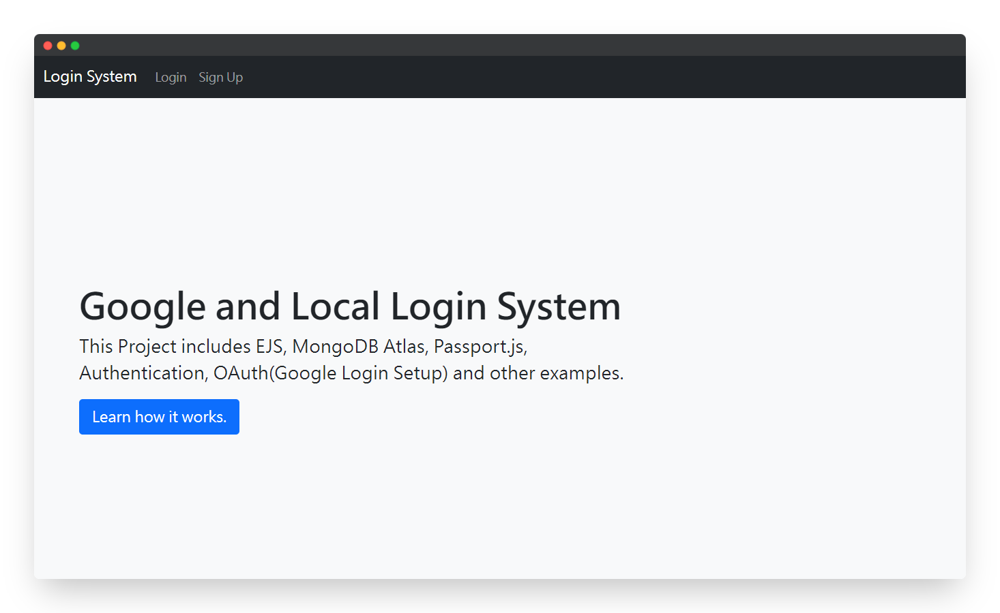
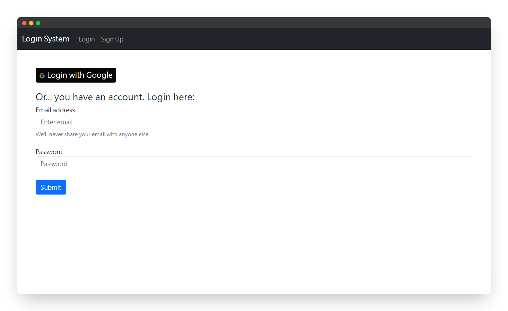
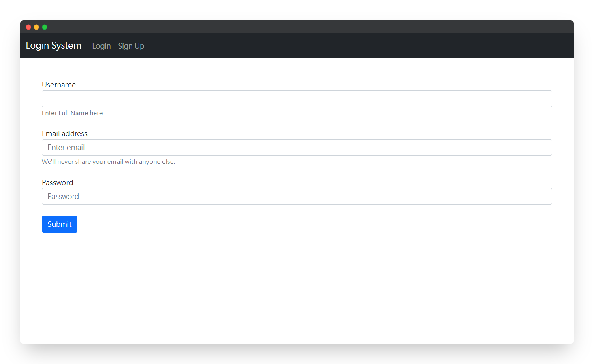
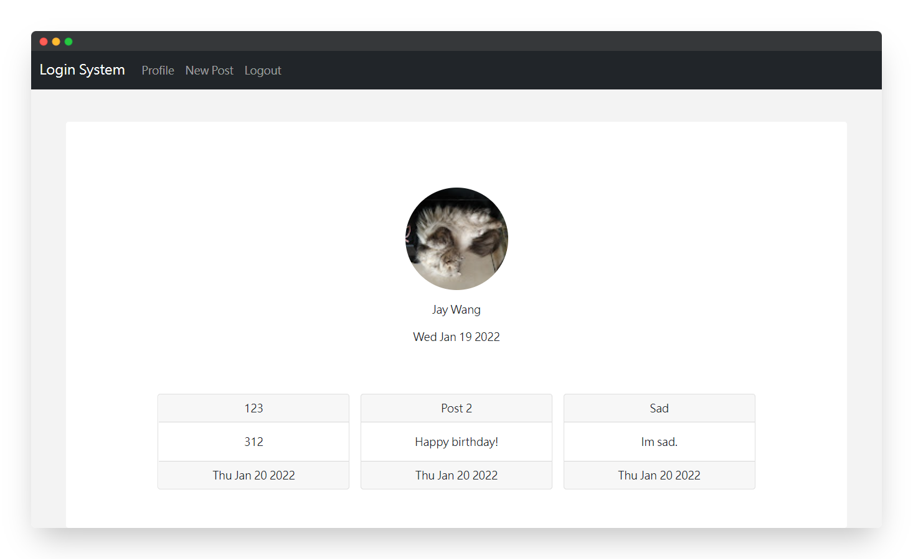
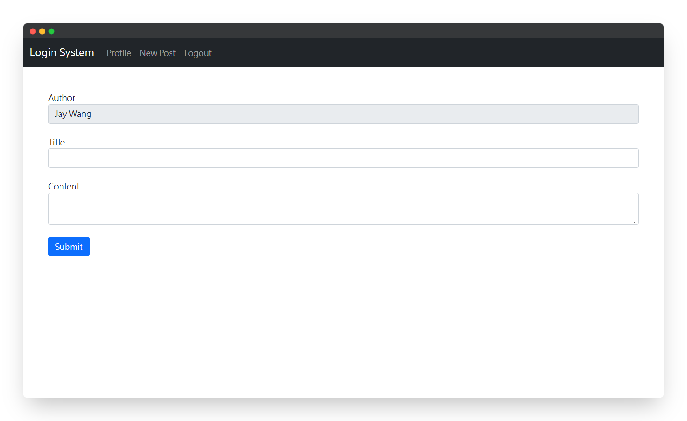
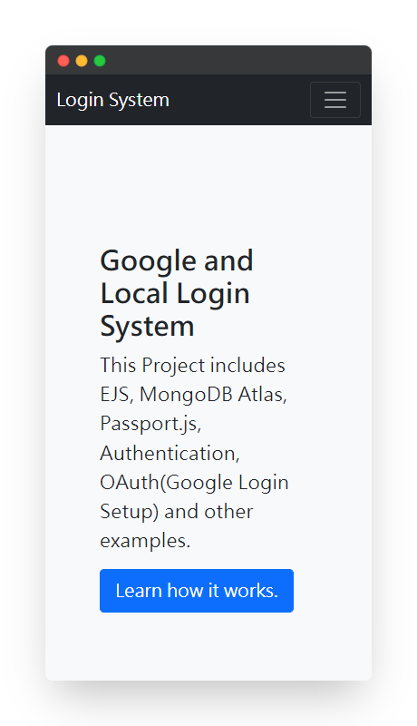
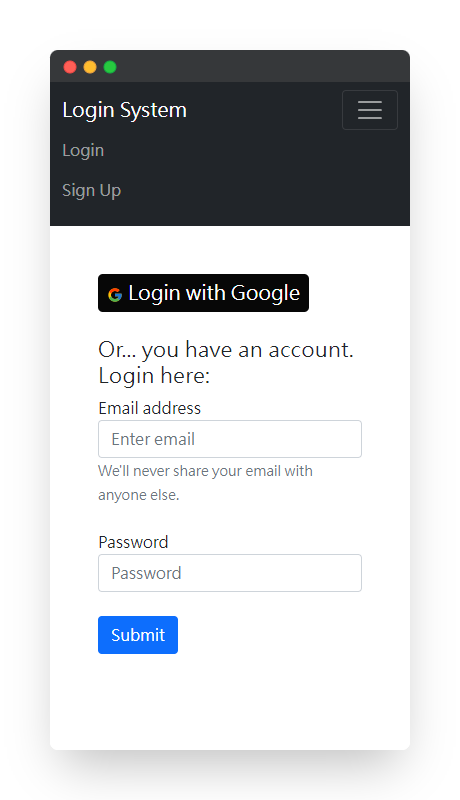
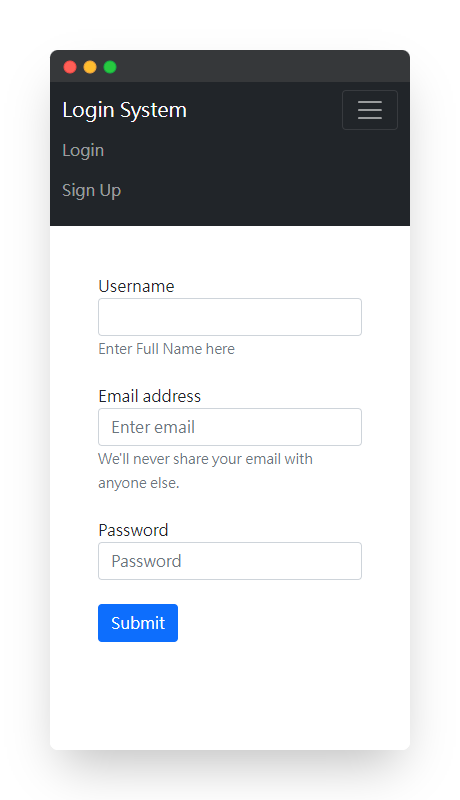
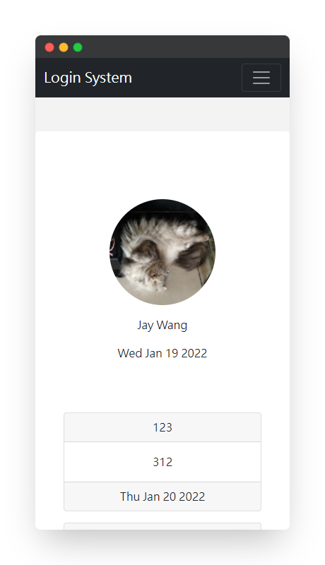
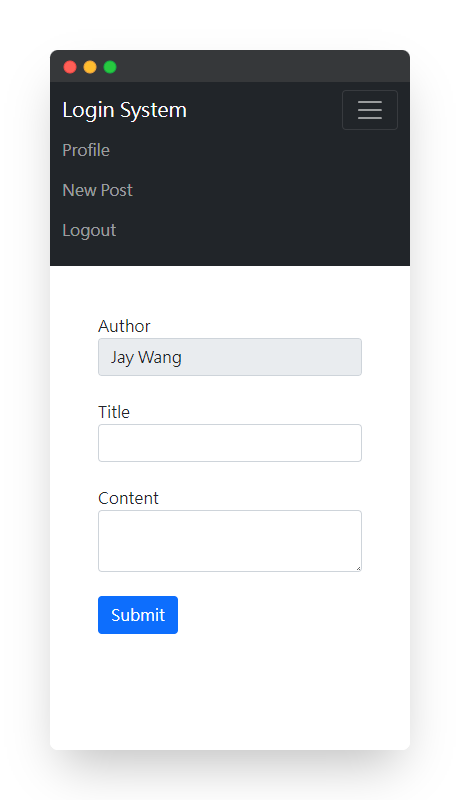


<!--
*** Thanks for checking out the Google-and-Local-Login-System. If you have a suggestion
*** that would make this better, please fork the repo and create a pull request
*** or simply open an issue with the tag "enhancement".
*** Thanks again! Now go create something AMAZING! :D
***
*** To avoid retyping too much info. Do a search and replace for the following:
*** github_username (that is "windsuzu"), repo_name (that is "Google-and-Local-Login-System"), project_title, project_description
-->

<!-- [![Issues][issues-shield]][issues-url] -->
[![Contributors][contributors-shield]][contributors-url]
[![MIT License][license-shield]][license-url]
[![Author][author-shield]][author-url]
[![LinkedIn][linkedin-shield]][linkedin-url]

<!-- PROJECT LOGO -->
 

  

  <h3 align="center">Google and Local Login System</h3>
  

    Login system using Google OAuth and local email/password.
     
    <a href="docs"><strong>Explore the docs »</strong></a>
     
     
    <a href="https://google-and-local-login-system.herokuapp.com/">View Demo</a>
    ·
    <a href="https://github.com/windsuzu/Google-and-Local-Login-System/issues">Report Bug</a>
    ·
    <a href="https://github.com/windsuzu/Google-and-Local-Login-System/issues">Request Feature</a>
  

Table of Contents

* [About](#about)
* [Features](#features)
* [Preview](#preview)
* [Roadmap](#roadmap)
* [License](#license)
* [Contact](#contact)
* [Acknowledgements](#acknowledgements)

---

<!-- ABOUT THE PROJECT -->
## About

<table>
<tr>
<td>

Google and Local Login System (GaLLS) 是一個展示 Google 及 Local 帳號登入的網站。GaLLS 使用 node.js 與 express.js 框架建立後端系統 (back-end)，以及使用 ejs 和 bootstrap 5 建立前端頁面 (front-end)。網站架設於 [Heroku](https://google-and-local-login-system.herokuapp.com/) 上。

GaLLS 使用 passport.js 來控制 Google 登入 (passport-google-oauth20)，以及透過伺服器資料庫帳號登入 (passport-local)。 Google 登入功能透過使用 Google Cloud Platform (GCP) 中的 OAuth 2.0 用戶端登入。 伺服器登入功能透過連接 MongoDB Atlas 建立 MongoDB 資料庫，並實作 bcrypt 加密用戶密碼，最後使用 passport-local 來驗證用戶登入。

關於 GCP、MongoDB Atlas 的建立流程與 passport.js 的核心概念可以參考以下的文件:

- [GCP OAuth 流程](docs/gcp-oauth.md)
- [MongoDB Atlas 流程](docs/mongodb-atlas.md)
- [passport.js 概念與實作](docs/passportjs.md)
- [上架 Heroku 前需要知道的事](docs/heroku.md)

其他的網站特色與功能，還有相關程式碼請參考 [Features](#features) 😊

Built With:
* `Bootstrap 5`
* `Node.js`, `Express.js`, `Express-Session`, `bcrypt`
* `ejs (Embedded Javascript)`
* `Google Cloud Platform`
* `MongoDB Atlas`, `mongoose`
* `passport.js`, `passport-google-oauth20`, `passport-local`
* `Heroku`

</td>
</tr>
</table>

---

## Features

* 建立 MongoDB Schemas
  * [用戶資料 (User)](https://github.com/windsuzu/Google-and-Local-Login-System/blob/main/models/user-model.js#L3-L28)
  * [發文 (Post)](https://github.com/windsuzu/Google-and-Local-Login-System/blob/main/models/post-model.js#L3-L20)
* 將資料寫入 MongoDB
  * [註冊 (Signup)](https://github.com/windsuzu/Google-and-Local-Login-System/blob/main/routes/auth-route.js#L72-L95)
  * [發文 (Post)](https://github.com/windsuzu/Google-and-Local-Login-System/blob/main/routes/profile-route.js#L22-L31)
* 使用 Flash 來回傳伺服器訊息
  * [設定 flash](https://github.com/windsuzu/Google-and-Local-Login-System/blob/main/index.js#L39-L45)
  * [呼叫 flash](https://github.com/windsuzu/Google-and-Local-Login-System/blob/main/routes/auth-route.js#L85-L88)
  * [[展示 flash 1]](https://github.com/windsuzu/Google-and-Local-Login-System/blob/main/views/components/message.ejs#L9-L13) [[展示 flash 2]](https://github.com/windsuzu/Google-and-Local-Login-System/blob/main/views/signup.ejs#L10)
* 使用 passport.js 的 strategy 來進行登入
  * Google
    * [Strategy, callback](https://github.com/windsuzu/Google-and-Local-Login-System/blob/main/configs/passport.js#L25-L52)
    * [Authenticate, redirect](https://github.com/windsuzu/Google-and-Local-Login-System/blob/main/routes/auth-route.js#L51-L64)
  * Local
    * [Strategy, callback](https://github.com/windsuzu/Google-and-Local-Login-System/blob/main/configs/passport.js#L60-L77)
    * [Authenticate, redirect](https://github.com/windsuzu/Google-and-Local-Login-System/blob/main/routes/auth-route.js#L97-L104)
* 使用 passport-session 和 AuthCheck 來判斷用戶是否已經登入
  * [[Passport Session]](https://github.com/windsuzu/Google-and-Local-Login-System/blob/main/index.js#L28-L36) [[Serialize / Deserialize]](https://github.com/windsuzu/Google-and-Local-Login-System/blob/main/configs/passport.js#L13-L17)
  * [利用 session 判斷是否能進入主頁](https://github.com/windsuzu/Google-and-Local-Login-System/blob/main/routes/profile-route.js#L5-L9)
  * [利用 session 判斷並渲染導航列的項目 (在 render 前需要傳入 user)](https://github.com/windsuzu/Google-and-Local-Login-System/blob/main/views/components/nav.ejs#L17-L38)
  * 利用 originalUrl 在登入後導向正確的網址
    * [[主頁]](https://github.com/windsuzu/Google-and-Local-Login-System/blob/main/routes/profile-route.js#L6) [[登入導向]](https://github.com/windsuzu/Google-and-Local-Login-System/blob/main/routes/auth-route.js#L36-L43) [[登出刪除 session]](https://github.com/windsuzu/Google-and-Local-Login-System/blob/main/routes/auth-route.js#L31)

## Preview

### Web-size

   
   
   
   
   

### Phone-size

   
   
   
   
   

## Roadmap

1. User Interface (ejs)
   - [x] Home
   - [x] Navbar
   - [x] Login
   - [x] SignUp
   - [x] Profile
   - [x] Post
   - [x] Flash
2. Environment
   - [x] [Mongodb Atlas](docs/mongodb-atlas.md)
   - [x] [Google Cloud Platform (OAuth)](docs/gcp-oauth.md)
   - [x] [Passport.js](docs/passportjs.md)
3. Back-end
   - [x] Express / Express-Router
   - [x] DotEnv
   - [x] Mongoose
   - [x] Passport.js / GoogleStrategy / LocalStrategy
   - [x] AuthCheck
   - [x] Cookie-Session
   - [x] Add Post
4. Front-End
   - [x] Login Function (Google, Local)
   - [x] SignUp Function (Local)
   - [x] Conditional Navbar
   - [x] Post Function
   - [x] Logout Function
5. Deployment
   - [x] Heroku

---

## License

Distributed under the MIT License. See [LICENSE](https://github.com/windsuzu/Google-and-Local-Login-System/blob/main/LICENSE) for more information.

## Contact

Reach out to the maintainer at one of the following places:

* [GitHub discussions](https://github.com/windsuzu/Google-and-Local-Login-System/discussions)
* The email which is located [in GitHub profile](https://github.com/windsuzu)

## Acknowledgements

* [Wilson Ren](https://www.udemy.com/user/wilson-r-6/)

[contributors-shield]: https://img.shields.io/github/contributors/windsuzu/Google-and-Local-Login-System.svg?style=for-the-badge
[contributors-url]: https://github.com/windsuzu/Google-and-Local-Login-System/graphs/contributors
[issues-shield]: https://img.shields.io/github/issues/windsuzu/Google-and-Local-Login-System.svg?style=for-the-badge
[issues-url]: https://github.com/windsuzu/Google-and-Local-Login-System/issues
[license-shield]: https://img.shields.io/github/license/windsuzu/Google-and-Local-Login-System.svg?style=for-the-badge&label=license
[license-url]: https://github.com/windsuzu/Google-and-Local-Login-System/blob/main/LICENSE
[linkedin-shield]: https://img.shields.io/badge/-LinkedIn-black.svg?style=for-the-badge&logo=linkedin&colorB=555
[linkedin-url]: https://linkedin.com/in/windsuzu
[pr-welcome-shield]: https://shields.io/badge/PRs-Welcome-ff69b4?style=for-the-badge
[author-shield]: https://shields.io/badge/Made_with_%E2%9D%A4_by-windsuzu-F4A92F?style=for-the-badge
[author-url]: https://github.com/windsuzu
