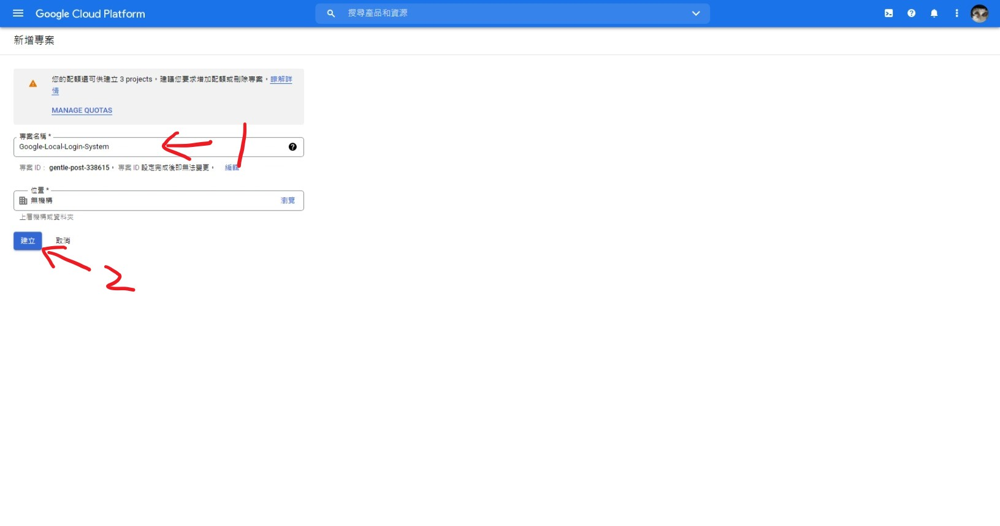
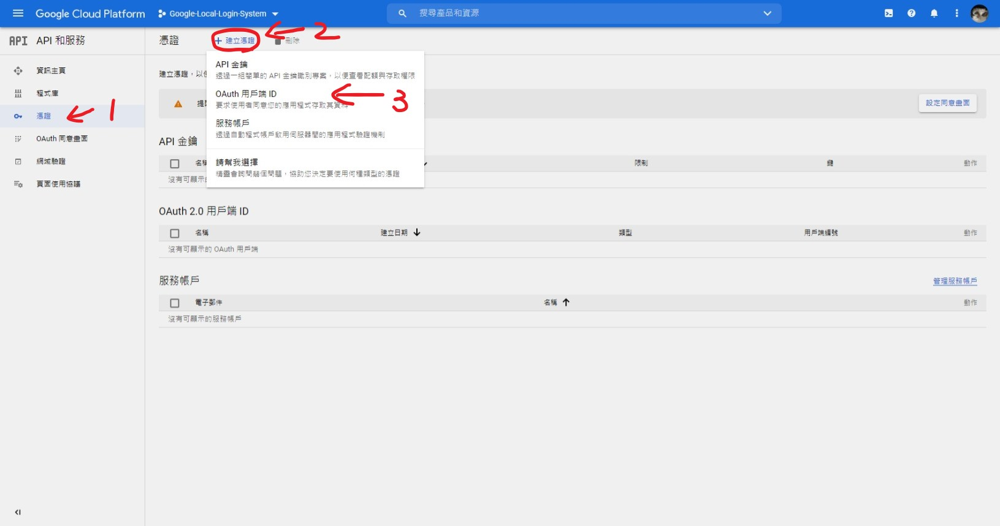
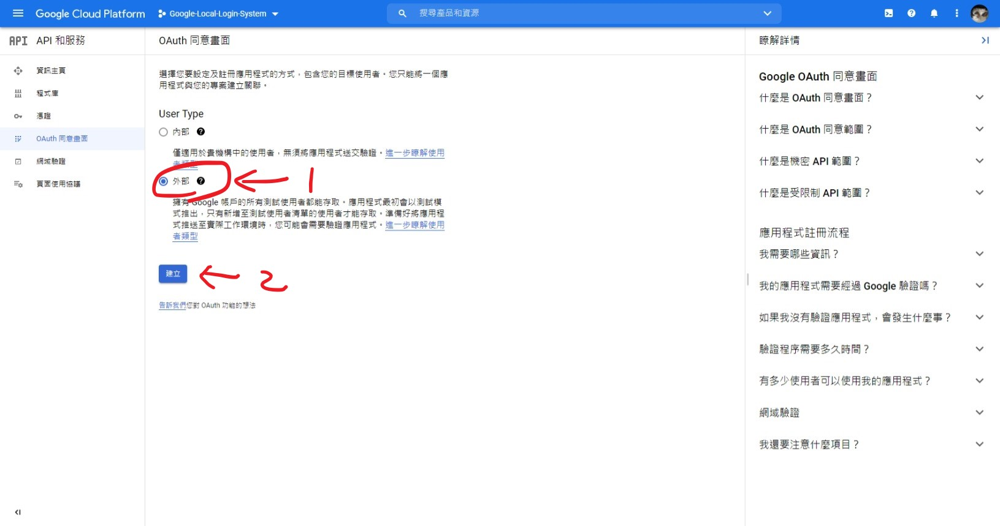
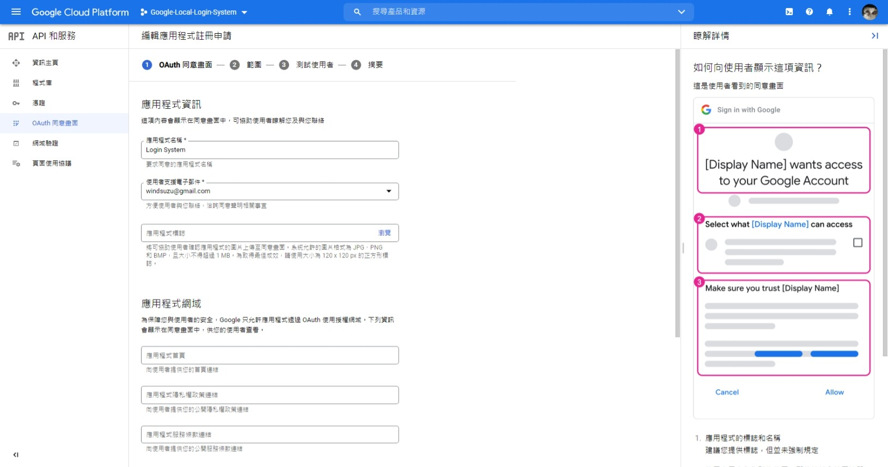
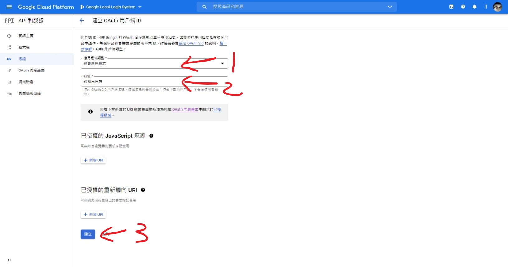
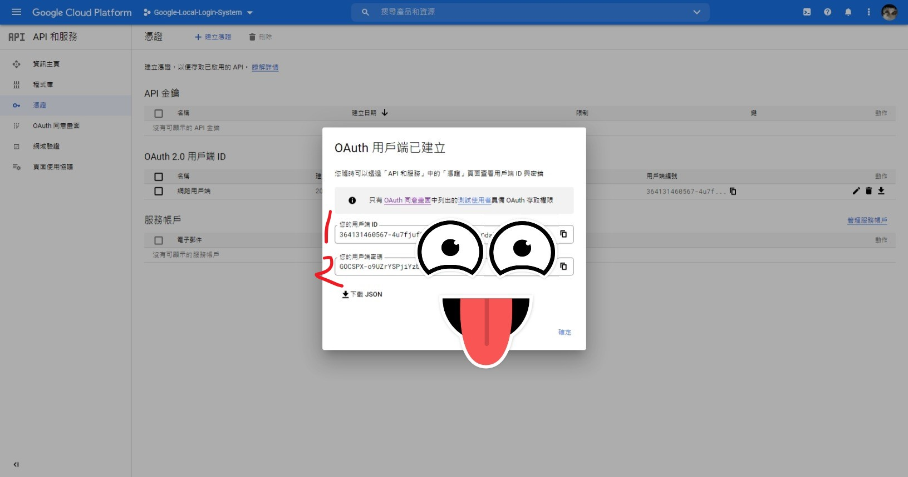
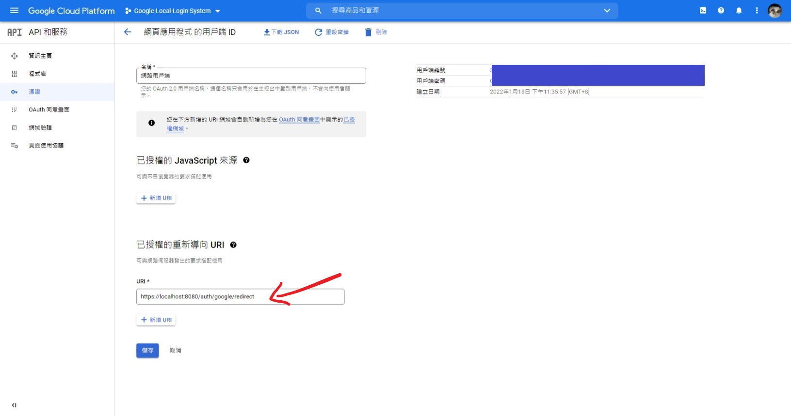

# Google Cloud Platform OAuth

要使用 Google 登入取得用戶資料之前，需要先到 Google Cloud Platform 開通並建立 OAuth 2.0 用戶端 ID。獲得的用戶端編號和密碼就可以透過 passport.js 來實作 Google 登入。

## Steps

* 註冊並登入 [Google Cloud Platform](https://console.cloud.google.com/)，建立新的專案

* 移動至 `API 和服務` -> `憑證`
* 點選 `建立憑證`
* 點選 `Oauth 用戶端 ID`

* 在 OAuth 同意畫面選擇 `外部`

* 跟著流程註冊申請 `OAuth 用戶端權限`

* 回到 `API 和服務` -> `憑證`
* 一樣點選 `建立憑證`
* 一樣點選 `Oauth 用戶端 ID`

* 選擇 `應用程式類型`
* 輸入 `用戶端名稱`

* 獲得 `用戶端ID` 和 `用戶端密碼`

* 到用戶端當中填入 `重新導向 url`

完成後我們就可以利用 passport.js 實作 Google 登入了 !