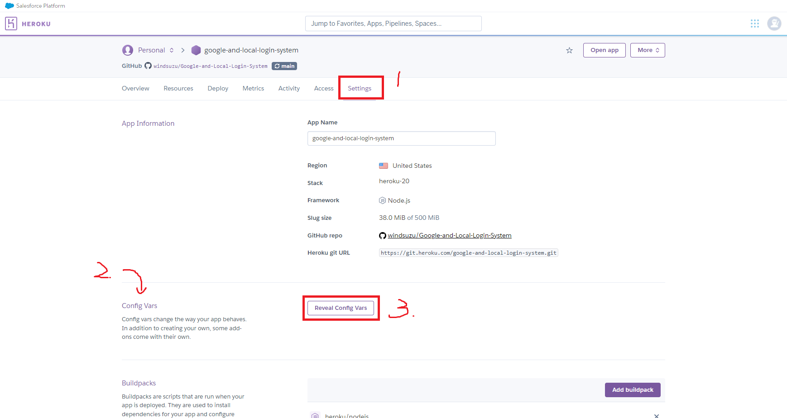
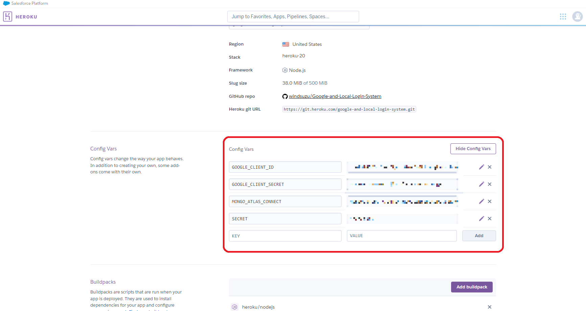
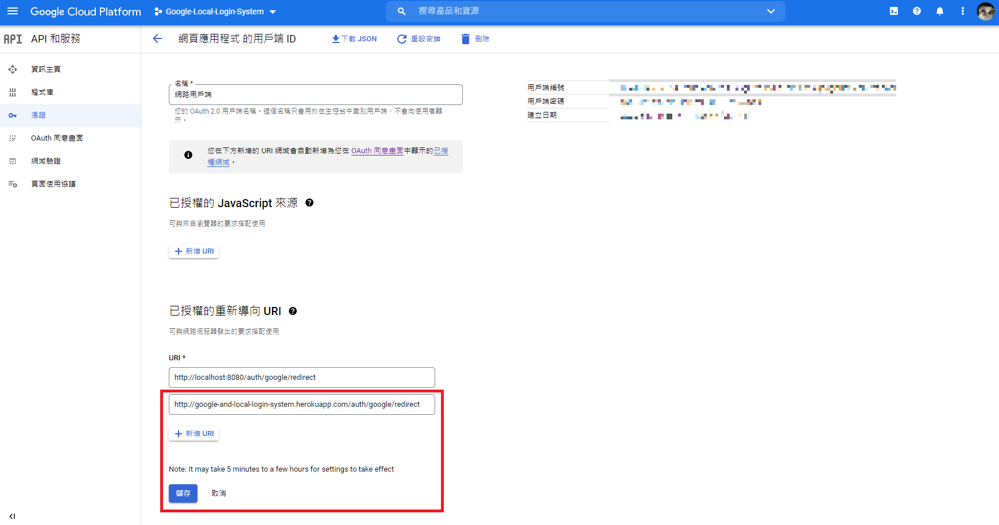

# Heroku Deployment

在將 express 專案上架至 Heroku 之前，有幾件事情需要先執行。

1. [Start Script](#start-script)
2. [Cookie-Session](#cookie-session)
3. [App Listen Port](#app-listen-port)
4. [Environment Variables (process.env.variables)](#environment-variables-processenvvariables)

## Start Script

在 package.json 中，我們需要在 script 加入 start 的指令，防止出現 `Start script missing error when running npm start`。

```
"start": "node index.js"
```

> * [source code](https://github.com/windsuzu/Google-and-Local-Login-System/blob/main/package.json#L8)
> * [stackoverflow](https://stackoverflow.com/questions/31976722/start-script-missing-error-when-running-npm-start)

## Cookie-Session

你可能會在上架 heroku 後看到以下提醒:

```
Warning: connect.session() MemoryStore is not designed for a production environment, 
as it will leak memory, and will not scale past a single process.
```

我們只需要將 `express-session` 改成 `cookie-session` 即可:

``` js
// const session = require("session-session");

npm install cookie-session
const session = require('cookie-session');
```

> * [source code](https://github.com/windsuzu/Google-and-Local-Login-System/blob/main/index.js#L11)
> * [stackoverflow](https://stackoverflow.com/questions/44882535/warning-connect-session-memorystore-is-not-designed-for-a-production-environm)

## App Listen Port

在 `index.js` 中我們必須讓 express 監聽 Heroku 所提供的埠 (port)，才能夠正確上架網頁。以下的 `app.listen` 將會使用 `process.env.PORT` 獲得 Heroku 所提供的埠；如果沒有獲得，則使用 3000 這個埠。

``` js
app.listen(process.env.PORT || 3000);
```

> * [source code](https://github.com/windsuzu/Google-and-Local-Login-System/blob/main/index.js#L55)
> * [用 Express.js 和 Heroku 部署 Web 应用](https://chinese.freecodecamp.org/news/how-to-deploy-your-site-using-express-and-heroku#:~:text=%E7%9A%84%20master%20%E5%88%86%E6%94%AF-,%E5%A6%82%E6%9E%9C%E5%BA%94%E7%94%A8%E7%A8%8B%E5%BA%8F%E4%B8%8D%E8%83%BD%E6%AD%A3%E5%B8%B8%E8%BF%90%E8%A1%8C%EF%BC%9F,-%E6%9C%89%E6%97%B6%E5%80%99%EF%BC%8C%E5%8D%B3%E4%BE%BF)

## Environment Variables

在開發專案時，我們使用 `dotenv` 來維護隱密字串。 即建立 `.env`，並以 `process.env` 呼叫變數。

Heroku 一樣有提供設定這些變數的地方，位置在專案的 `Setting` -> `Config Vars`。



設定方式與 `.env` 設定的 key-value pair 一模一樣，並且呼叫方式也是透過 `process.env`，所以完全不需要修改原本的程式碼。



## Google Redirect URL

最後，因為 GoogleStrategy Callback 的 url 不再是 localhost，所以我們要到 Google Cloud Platform 的 `OAuth 2.0 用戶端 ID` 中新增 Heroku 的重新導向網址。

