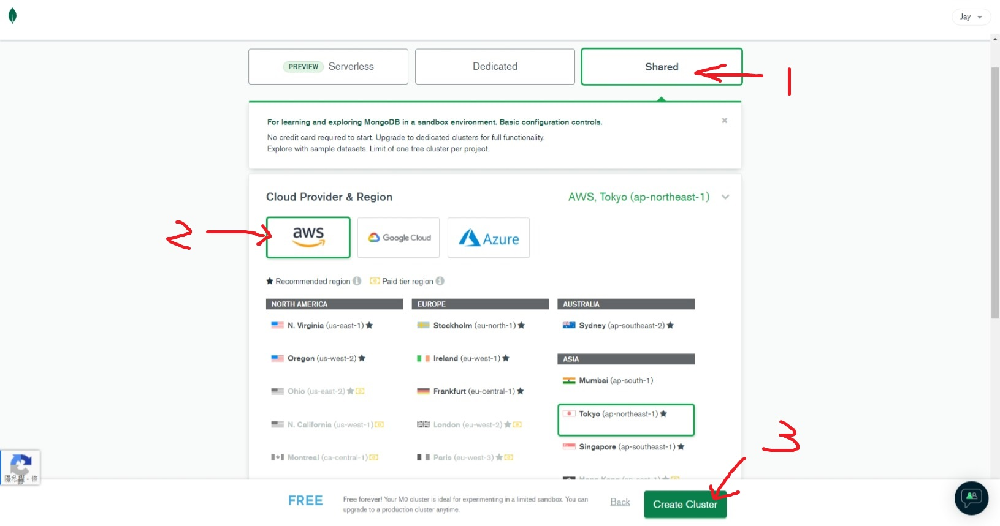
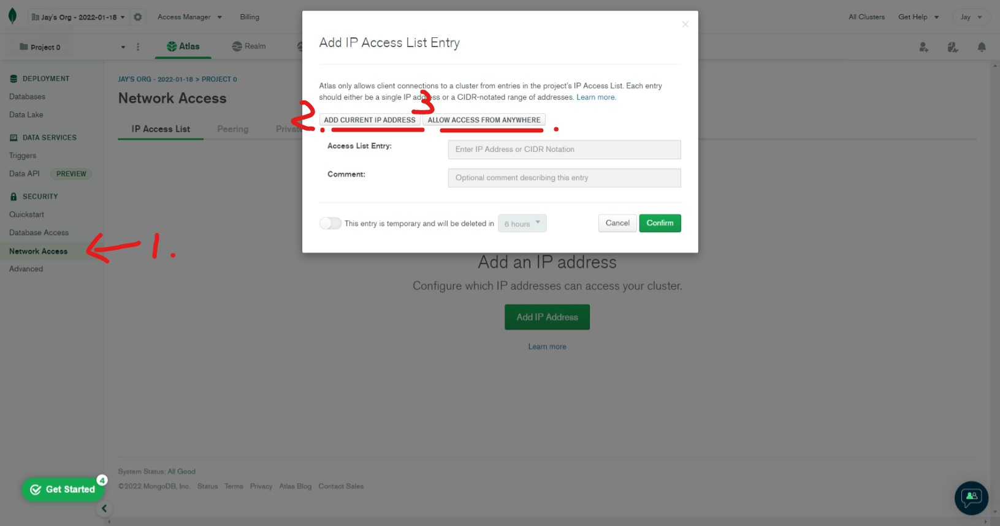
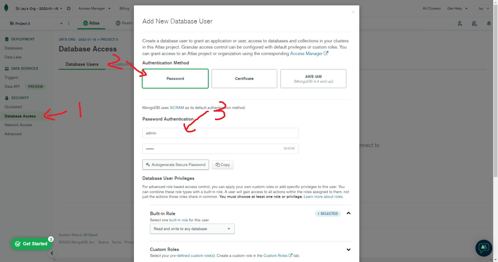
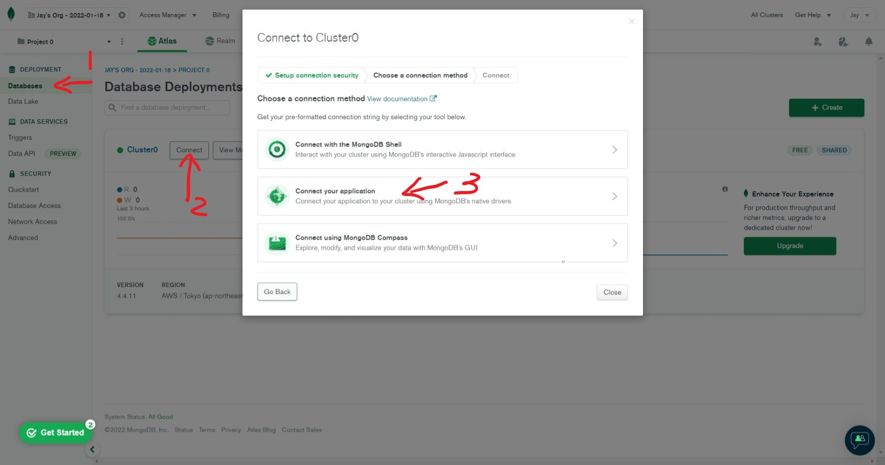
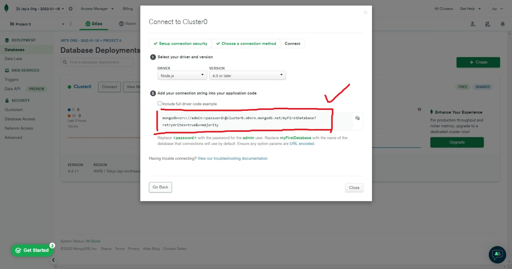

# MongoDB Atlas Setup

MongoDB Atlas 提供免費的雲端 Mongodb 資料庫服務。透過以下流程，我們可以註冊並在 express 專案中使用 mongodb 的功能。

## Connect Steps

* 選擇 shared cluster 方案後
* 選擇 AWS 服務，地區隨便選



* 來到 network access
* 將個人 IP 列入存取名單，使該 IP 可以存取資料庫
* 將代表所有人的 IP 列入存取名單，使所有人都可以存取資料庫



* 來到 database access
* 建立一個管理者帳號密碼，該帳號及密碼將用於 express 連接



* 來到 Database
* 點選 cluster 的 connect 按鈕
* 選擇 `connect your application`



* 取得 express 所需的連接字串



* 安全起見，放入 .env 中，填入 password

```
MONGO_ATLAS_CONNECT=mongodb+srv://<username>:<password>@cluster0.o0xro.mongodb.net/myFirstDatabase?retryWrites=true&w=majority
```

* 在 `index.js` 連接 mongodb atlas

``` js
mongoose
    .connect(process.env.MONGO_ATLAS_CONNECT, {
        useNewUrlParser: true,
        useUnifiedTopology: true,
    })
    .then(() => console.log("Connect to MongoDB Atlas"))
    .catch((err) => console.log(err));
```

完成後即可開始使用 mongodb 的功能 !