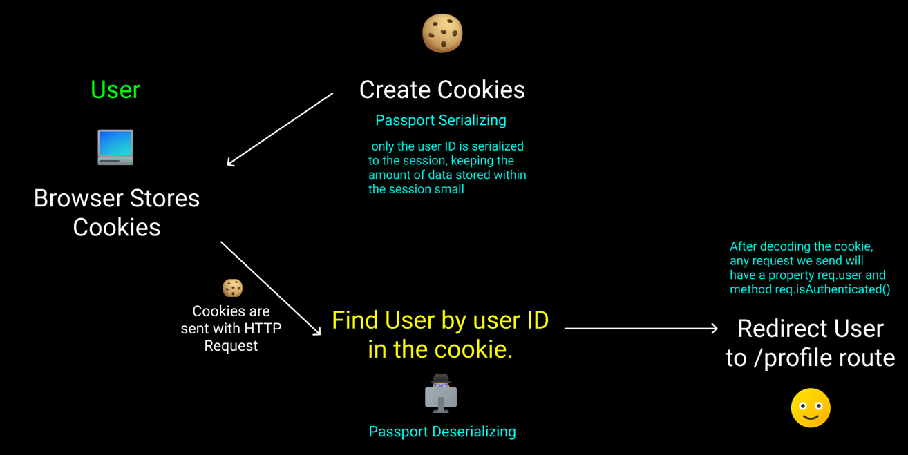

# Passport.js

**Passport.js** 是一個可以用於 express-based 網頁應用程式的 middleware。**Passport.js** 提供非常多的策略 (strategy) 來進行認證，例如 username/password、Facebook、Google、Twitter 等。

## 安裝

我們在這次實作中要使用 Google 和 Local (username/password)，所以要在 npm 安裝以下的套件:

* [passport-google-oauth20](https://www.passportjs.org/packages/passport-google-oauth20/)
* [passport-local](https://www.passportjs.org/packages/passport-local/)

```
npm install passport passport-google-oauth20 passport-local
```

## Concept

要使用 passport.js 來驗證帳號需要先知道 passport.js 的核心架構大致分為以下四個:

* [Strategy](#strategy)
* [Callback](#callback)
* [Middleware](#middleware)
* [Session](#session)

### Strategy

Passport 利用各種 **strategy** (username/password, Oauth, etc) 來驗證登入的網路請求 (authenticate request)。我們可以在[官網的 Strategy](https://www.passportjs.org/) 找到 500 個以上的 **strategies**。例如 `passport-local`, `passport-facebook`, `passport-google-oauth` 等。

Passport 使用 `use()` 來設定這些 **strategy** 的驗證方法 (authenticate)、回傳函式 (callback)。

``` js
var passport = require('passport'), 
    LocalStrategy = require('passport-local').Strategy;

passport.use(new LocalStrategy((username, password, done) =>

    // authenticate ...

    // callback ...

));
```

### Callback

在 strategy 認證成功或失敗都需要回傳結果。我們可以用 `done` 來傳送結果，有三種情況:

1. 認證成功

``` js
return done(null, user);
```

2. 認證失敗 (用戶方錯誤，例如打錯帳號密碼)


``` js
return done(null, false);

// message 可以搭配 Flash message 使用。
return done(null, false, { message: 'Incorrect password.' });
```

3. 認證失敗 (伺服器錯誤，例如資料庫當機)

``` js
return done(err);
```

### Middleware

接著我們需要在 index.js 的 middleware 初始化 passport。

``` js
app.use(passport.initialize());
```

若使用的是 **stateful authentication** (session-based 的認證) 時，你需要額外也初始化 session。 Passport 的 session 要在 cookie-session 之後啟動。

``` js
app.use(CookieSession({ keys: [process.env.COOKIE_SECRET] }));
app.use(passport.session());
```

### Session (stateful authentication)

當登入成功時，伺服器會建立驗證的 session，並在用戶端瀏覽器的 cookie 中放入驗證資訊，方便之後透過該資訊驗證其他的網路要求 (request)。

Passport 使用的驗證資訊是 user.id，並且使用**序列化 / 反序列化 (serialize / deserialize)** user.id 來和 session 驗證。



> Passport Sessions drawn by [Wilson Ren](https://www.udemy.com/user/wilson-r-6/)

在 deserialize 且驗證成功後，每個 req 都將包含 `req.user` 和 `req.isAuthenicated()` 及 `req.logOut()` 三個函式。

``` js
passport.serializeUser((user, done) => {
  done(null, user.id);
});

passport.deserializeUser((id, done) => {
  User.findById(id, (err, user) => {
    done(err, user);
  });
});
```

## Example

### Google

#### Authenticate, Redirect

* auth-route.js

``` js
router.get(
    "/google",
    passport.authenticate("google", {
        scope: ["profile", "email"],
        prompt: "select_account",
    })
);

// The url ("/google/redirect") equals to `callbackURL` in GoogleStrategy 
router.get("/google/redirect", passport.authenticate("google"), (req, res) =>
    res.redirect("/profile")
);
```

* profile-route.js

``` js
// Middleware checks if the user is logged in
const authCheck = (req, res, next) => {
    if (!req.isAuthenticated()) res.redirect("/auth/login");
    else next();
};

// 1. Put the middleware in the second parameter
// 2. Benefit from Session authentication, we can get user data from req.user
router.get("/", authCheck, (req, res) => {
    res.render("profile", { user: req.user });
});
```

#### Passport Strategy, Callback

* passport.js

``` js
passport.use(
    // passport strategy
    // `callbackURL` needs to be added in the Google Cloud Platform
    new GoogleStrategy(
        {
            clientID: process.env.GOOGLE_CLIENT_ID,
            clientSecret: process.env.GOOGLE_CLIENT_SECRET,
            callbackURL: "/auth/google/redirect",
        },
        // passport callback
        (accessToken, refreshToken, profile, done) => {
            User.findOne({ googleId: profile.id })
                .then((foundUser) => {
                    if (foundUser) done(null, foundUser);
                    else {
                        new User({
                            name: profile.displayName,
                            googleId: profile.id,
                            avatarUrl: profile.photos[0].value,
                            email: profile.emails[0].value,
                        })
                            .save()
                            .then((newUser) => done(null, newUser))
                            .catch((err) => done(err));
                    }
                })
                .catch((err) => done(err));
        }
    )
);
```

在 callback 中會先到 mongodb 確認:

1. 若用戶已在 mongodb，就直接回傳用戶資料 `done(null, foundUser);`
2. 若用戶不在 mongodb，則創立用戶資料後再回傳 `done(null, newUser)`

---

### Local

